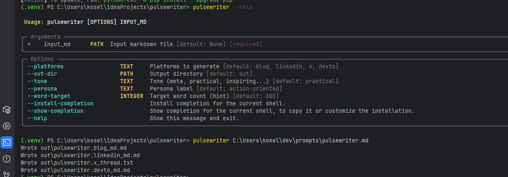
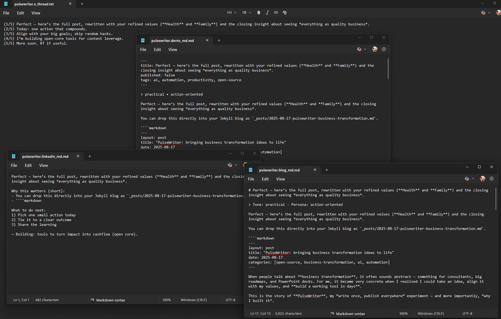

PulseWriter is my "write once, publish everywhere" experiment—small, fast, and aligned with my values of **Health** and **Family**. Here's how it came to life and why it matters.

<!--more-->

> 🙌 **Support the Journey**  
> Sponsor me on [GitHub](https://github.com/sponsors/nikitakoselev) or buy me a ☕ on [Buy Me a Coffee](https://buymeacoffee.com/2o3yfdbjpo).

---

## A bigger life transformation 🌱

For me, **business transformation** isn’t just a buzzword — it’s become the lens through which I live.

I root everything in two values:

- **Health 🧠💪** — physical, financial, mental, educational. If I collapse in one area, I lose the power to act.
- **Family 👨‍👩‍👦** — my close family first, but also humanity as a whole. The way to serve is to start by “cleaning my own room”: taking microsteps that strengthen my health, which then ripple outward.

From these values flow my goals:
- **Operational**: daily actions that keep me strong and balanced.
- **Tactical**: building tools that free time and mental energy.
- **Strategic**: creating systems (income flows, automation, open source) that sustain my family and contribute to the wider human family.

---

## Why PulseWriter? 🚀

This philosophy led me to a simple frustration:
I wanted to share my thoughts online. But every platform — blog, LinkedIn, X, Dev.to — demanded a different format. Copy-pasting was not just boring, it was draining.

So I asked: *what if I could write once, and let a tool transform it for me?*

That became **PulseWriter**: my “write once, publish everywhere” experiment. Not a Markdown slicer — but a tool that uses **AI and prompt libraries to craft drafts suited to each platform**.

---

## How I built it (from a sofa) 🛋️

The first attempt was messy: broken imports, missing modules, a README pointing to a non-existent command.

But with help from today’s tools, it came together quickly:
- **Codex** and **ChatGPT** for debugging and fixes.
- **VS Code** and **GitHub Copilot** for rapid coding.
- **IntelliJ IDEA** for day-to-day (sorry Microsoft — but as a Java engineer doing a Python project, IntelliJ feels natural).

And the kicker: I built it in just a few hours, lying on a sofa at my parents’ place, on an old **Microsoft Surface Go 3**. No desk. No big setup. Just stubbornness and focus.

Within hours, PulseWriter went from broken to working:

```bash
pulsewriter transform post.md --platforms blog linkedin x devto --out-dir out
```

And out came four drafts — one for each platform.


*First successful run in IntelliJ’s terminal.*


*The generated drafts — Blog, LinkedIn, X, Dev.to — all open side-by-side.*

---

## What it does today ✨

Right now PulseWriter:
- Reads a single Markdown file.
- Generates drafts for Blog, LinkedIn, X, Dev.to using Jinja2 templates.
- Saves hours of repetitive formatting.

Here are the first outputs it produced:
- 📝 [Blog draft](https://raw.githubusercontent.com/nikitakoselev/nikitakoselev.github.io/main/assets/markdown/pulsewriter.blog_md.md)
- 💼 [LinkedIn draft](https://raw.githubusercontent.com/nikitakoselev/nikitakoselev.github.io/main/assets/markdown/pulsewriter.linkedin_md.md)
- 🌐 [Dev.to draft](https://raw.githubusercontent.com/nikitakoselev/nikitakoselev.github.io/main/assets/markdown/pulsewriter.devto_md.md)
- 🐦 [X draft](https://raw.githubusercontent.com/nikitakoselev/nikitakoselev.github.io/main/assets/text/pulsewriter.x_thread.txt)

The X version still needs work — but it’s a start. The magic is seeing one idea flow instantly into multiple formats.

---

## Where it’s going 🔭

This is just step one.

The vision is for PulseWriter to:
- Use **AI + prompt libraries** to tailor outputs, not just slice text.
- Adapt prompts based on my reactions (with another open-source tool I’m planning).
- Tie into **n8n** workflows so drafts don’t just get generated, but also published.
- Explore tools like **Tessl** to map feature lists and generate the products I need for myself, my family, and humanity.

PulseWriter will grow. But the deeper transformation is already here:
> Each microstep makes me healthier, more focused, and more able to contribute to my close and extended family.

---

## Closing thought 💭

Business transformation doesn’t have to start in a boardroom. It can start with one person, two values, a sofa, an old Surface Go 3 — and the decision to fix a messy repo.

Even one person can treat every microstep as quality business — creating value, growing health, and making the world a bit better.

---

👉 Code: [github.com/nikitakoselev](https://github.com/nikitakoselev)
👉 Blog: [nikitakoselev.github.io](https://nikitakoselev.github.io/)
👉 Support: [GitHub Sponsors](https://github.com/sponsors/nikitakoselev) · [Buy Me a Coffee](https://buymeacoffee.com/2o3yfdbjpo)
